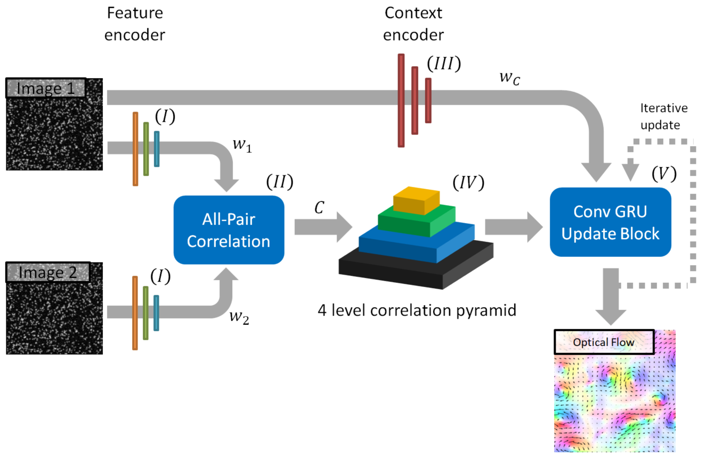

## Deep Recurrent Optical Flow Learning for Particle Image Velocimetry Data



## Overview
This is the official PyTorch implementation of "Deep Recurrent Optical Flow Learning for Particle Image Velocimetry Data" (RAFT-PIV). 
In this work, we propose a deep neural network-based approach for learning displacement fields in an end-to-end manner, focusing on the specific case of Particle Image Velocimetry (PIV). 
PIV is a key approach in experimental fluid dynamics and of fundamental importance in diverse applications, including automotive, aerospace, and biomedical engineering. 

The underpinning optical flow architecture was provided by the authors **Zachary Teed** (Princeton University) and **Jia Deng** (Princeton University):

[Recurrent All Pairs Field Transforms for Optical Flow (github)](https://github.com/princeton-vl/RAFT)

## Requirements
The code has been tested with PyTorch 1.7 and Cuda 10.1.
```Shell
conda create --name raft-piv
conda activate raft-piv
conda install pytorch=1.7.0 torchvision=0.8.1 cudatoolkit=10.1.243 matplotlib tqdm tensorboard scipy opencv -c pytorch
conda install -c conda-forge ifcfg pytest-socket
pip install --extra-index-url https://developer.download.nvidia.com/compute/redist nvidia-dali-cuda100
```
If DALI is not properly installed, please refer to the official [NVIDIA DALI](https://docs.nvidia.com/deeplearning/dali/user-guide/docs/installation.html) installation guidelines.

## Pretrained models
Pretrained models can be found in `/precomputed_ckpts`. Four pretrained models are available:
* RAFT32-PIV_ProbClass1: RAFT32-PIV model pretrained on a training dataset of Problem Class 1
* RAFT32-PIV_ProbClass2: RAFT32-PIV model pretrained on a training dataset of Problem Class 2
* RAFT256-PIV_ProbClass1: RAFT256-PIV model pretrained on a training dataset of Problem Class 1
* RAFT256-PIV_ProbClass2: RAFT256-PIV model pretrained on a training dataset of Problem Class 2

## Required Data
To train RAFT-PIV, you will need to download the required datasets. 
* [Dataset Problem Class 1](https://github.com/shengzesnail/PIV_dataset)

Minimal training and validation datasets of Problem Class 1 & 2 can be found in `/data`. 

Our dataset of Problem Class 2 can be downloaded from Zenodo (DOI: `10.5281/zenodo.4432496`).
* [Dataset Problem Class 2](https://zenodo.org/record/4432496#.YMmLT6gzZaQ)

Seven synthetic and experimental measurement test cases are provided:
* Backward facing step ('backstep')
* Flow past a cylinder ('cylinder')
* Direct numerical simulation of a turbulent channel flow ('jhtdb')
* Direct numerical simulation of isotropic turbulence ('dns_turb')
* Simulations of a sea surface flow ('sqg')
* Direct numerical simulation of a transitional boundary layer ('tbl')
* Experimental measurement data of a turbulent wavy channel flow ('twcf')

## Evaluation
You can evaluate a pretrained RAFT32-PIV model using `RAFT32-PIV_test.py`. The following command is an example for inference on the 'backstep' test data using a checkpoint which is pretrained on Problem Class 1:
 ```Shell
python RAFT32-PIV_test.py --nodes 1 --gpus 1 --name RAFT32-PIV_test_backstep --input_path_ckpt ./precomputed_ckpts/RAFT32-PIV_ProbClass1/ckpt.tar --test_dataset backstep --plot_results True
```

To evaluate a pretrained RAFT256-PIV model use `RAFT256-PIV_test.py`. The following command shows an example for the 'cylinder' test case using a model pretrained on Problem Class 2:
```Shell
python RAFT256-PIV_test.py --nodes 1 --gpus 1 --name RAFT256-PIV_test_cylinder --input_path_ckpt ./precomputed_ckpts/RAFT256-PIV_ProbClass2/ckpt.tar --test_dataset cylinder --plot_results True
```

## Training
Training a new RAFT32-PIV from scratch works as follows:
```Shell
python RAFT32-PIV_train.py --nodes 1 --gpus 2 --name RAFT32-PIV_newModel_ProbClass2 --batch_size 25 --epochs 100 --recover False --train_tfrecord ./data/minimal_training_dataset_ProbClass2_32px.tfrecord-00000-of-00001 --train_tfrecord_idx ./data/idx_files/minimal_training_dataset_ProbClass2_32px.idx --val_tfrecord ./data/minimal_validation_dataset_ProbClass2_32px.tfrecord-00000-of-00001 --val_tfrecord_idx ./data/idx_files/minimal_validation_dataset_ProbClass2_32px.idx
```
This command trains a new model on 1 node with 2 gpus for 100 epochs using the Problem Class 2 training and validation dataset with a batch size of 25.
Alternatively, you can train a new RAFT256-PIV model from scratch using the following command. It trains a model on 1 node with 2 gpus for 50 epochs using the Problem Class 1 training and validation dataset with a batch size of 5:
```Shell
python RAFT256-PIV_train.py --nodes 1 --gpus 2 --name RAFT256-PIV_newModel_ProbClass1 --batch_size 5 --epochs 50 --recover False --train_tfrecord ./data/minimal_training_dataset_ProbClass1_256px.tfrecord-00000-of-00001 --train_tfrecord_idx ./data/idx_files/minimal_training_dataset_ProbClass1_256px.idx --val_tfrecord ./data/minimal_validation_dataset_ProbClass1_256px.tfrecord-00000-of-00001 --val_tfrecord_idx ./data/idx_files/minimal_validation_dataset_ProbClass1_256px.idx
```
